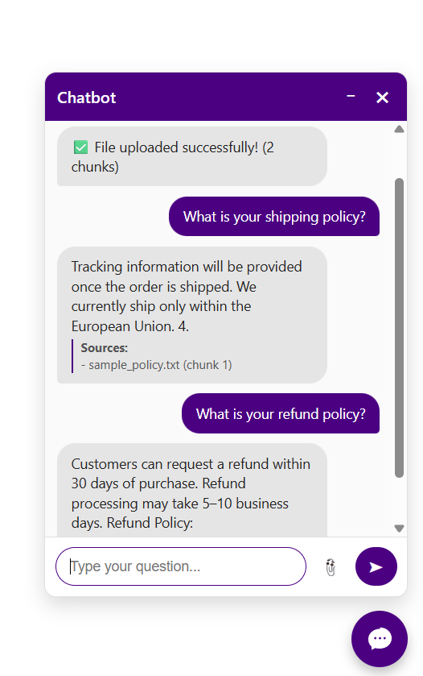
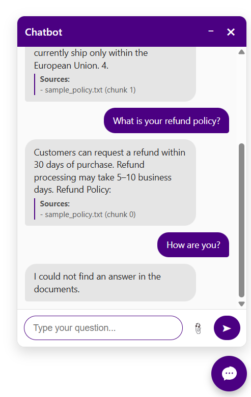

# Web Chatbot with Qdrant

## Description

This project is a web-based chatbot that can answer questions based on uploaded documents and CMS content.  
It uses **Qdrant** as a vector database and **FastAPI** as the backend. The chatbot can be embedded on a website with a responsive, bubble-style interface.

**Key features:**
- Upload files (CSV, DOCX, TXT, PDF) or CMS content (JSON)
- Store embeddings and metadata in Qdrant
- Answer questions using semantically closest document fragments
- Frontend with responsive chat UI 

## Project Structure
web_chatbot/
│
├── backend/
│   ├── app.py
│   ├── embeddings.py
│   ├── qdrant_utils.py
│   ├── document_parser.py 
│
├── frontend/              
│   ├── index.html
│   ├── style.css
│   ├── script.js
│
├── README.md
├── requirements.txt        


## Setup Instructions
 
 1. Clone the repository:
```bash
git clone <repo_url>
cd project/backend

*2. Create and activate a virtual environment:

bash
python -m venv venv
# Linux/macOS
source venv/bin/activate
# Windows
venv\Scripts\activate

*3. Install dependencies:

bash
pip install -r requirements.txt

Requirements include: fastapi, uvicorn, sentence-transformers, qdrant-client, python-docx, pdfminer.six, pandas.

*4. Configure environment variables:
Create a .env file with your Qdrant credentials:

env
QDRANT_URL="your_qdrant_url"
QDRANT_API_KEY="your_api_key"

*5. Run the backend:

bash
uvicorn app:app --reload

*6. Open frontend/index.html in your browser to interact with the chatbot.

Or use Live Server in VS Code for automatic reload

API will be available at:

http://127.0.0.1:8000

**Example cURL Commands**

Upload a file

curl -X POST "http://127.0.0.1:8000/upload-file/" \
  -F "file=@./sample_files/sample_policy.txt"


Ask a question

curl -X POST "http://127.0.0.1:8000/ask/" \
  -F "question=What is your refund policy?"

#Sample Files

You can test the chatbot using files in sample_files/:

sample_policy.txt


#Error Handling

If no data is found: "I could not find an answer in the documents."

#Network Restrictions

Some networks (e.g. university, library, corporate Wi-Fi) may block port 6333, which is used by Qdrant Cloud.

If you get timeouts, try:

Switching to home Wi-Fi or mobile hotspot.

Using a VPN.

Running Qdrant locally with Docker (recommended).

## Chatbot UI

Here is the chatbot interface in action:



---

## Example Query

Example of asking a question and receiving an answer:



#Frontend

HTML: index.html embeds the chatbot window.

CSS: styles.css for chat bubble, colors, fonts, borders, and responsive design.

JS: chatbot.js handles sending questions to the backend and displaying answers.

#Vector Database (Qdrant)

Stores embeddings generated using SentenceTransformers all-MiniLM-L6-v2.

Each vector includes metadata:

source (filename or CMS title)

chunk (text fragment number)

text (original chunk content)

Uses COSINE similarity to find top-K relevant chunks.

#Final Deliverables Checklist

- [x]Frontend chatbot embedded and styled on website

- [x] Chat interface working (send and receive messages)

- [x] File upload functionality (CSV, DOCX, PDF)

- [x] CMS content ingestion

- [x] Backend processing files and storing embeddings in Qdrant

- [x] Chatbot answers questions based on content

- [x]Documentation (README with installation, usage, screenshots)

#Notes & Future Improvements

Security: Keep API keys in .env, never hardcode.

Future: Integrate LLM for better answers, add authentication, support more file types.

Performance: Consider chunking large documents to improve retrieval.
